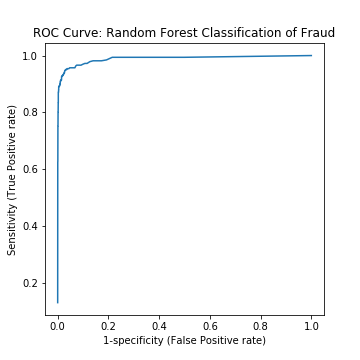

# Fraud Detection Case Study

## Premise of Case:
You are a contract data scientist/consultant hired by a new e-commerce site to try to weed out fraudsters.  The company unfortunately does not have much data science expertise... so you must properly scope and present your solution to the manager before you embark on your analysis. Also, you will need to build a sustainable software project that you can hand off to the companies engineers by deploying your model in the cloud.  Since others will potentially use/extend your code you **NEED** to properly encapsulate your code and leave plenty of comments.
You will work with the entire end to end pipeline of data science through a case study. 

Topics included in this case study include:
* Classification modeling.
* Programming Practice: Handing off models. 
* Teamwork.
* Web applications.
* Website hosting with AWS
* Deploying a DS application.
* Data visualization.
* Results presentation.

## Rough plan 

* EDA
* Model testing and comparison
* Get training data into MongoDB
* Pull live event data and predict on it
* Store the new predictions in MongoDB
* Wrap results in a  Flask webapp to display 50 recent events with fraud predictions
* Host everything on AWS so web app is public

## Deliverables

* A dashboard for investigators to use which helps them identify new events that are worthy of investigation for fraud.  This will pull in new data regularly, and update a useful display for the investigation team. 
    * Flask app needs to query live data from our server 
        * Needs to accept input records on POST `/score` endpoint
    * Web based front-end to enable quick triage of potential fraud
        * Triage importance of transactions (low risk, medium risk, high risk)
* A ten-minute presentation on your process and results. 

## The Data

NOTE: This data is VERY sensitive!

It is located in `data/data.zip`.

***Do not share this data with anyone! Do not include the data file in your pull request!***

## My evaluation of fraud and initial EDA
Something er thought a lot about throughout this case study is how the product of my client fits into the given technical process. A few points to note about the case of fraud:

* Failures are not created equal
    * False positives decrease customer/user trust
    * False negatives cost money
        * Not all false negative cost the same amount of money
* Accessibility
    * Other (non-technical) people may need to interact with the model/machinery
    * Manual review

My model is being used only the first step in the fraud identification process. We do not use the model to declare a ground truth about fraud or not fraud, but simply to flag which transactions need further manual review.  Because of this, my team and I figured it is more important to catch all fraud and not worry about false positives because being overly caustious is more critical than letting fraud slip by.

To create a target column, I added a 'Fraud' column that contains True or False values depending on if the event is fraud. If `acct_type` field contains the word `fraud`, the label of that point was Fraud.

We did a number of EDA steps to figure out what features may be important and what feature engineering could be done:
   
    1. Check how many fraud and not fraud events you have.

    2. Look at the features.

    3. Do any data visualization that helps understand the data.

    4. There was a specific feature buried inside a dictionary of features called tickets sold. This feature seemed to be very important in prediction fraud.


## Pickled model

After testing a number of different models, the most successful turned out to be Random Forest. Our model had an ROC-AUC of 0.94 and accuracy of 98.5. The model was stored in `pickle` format to serialize my trained model and store it in a file. This allowed me to use the model without retraining it for every prediction.

<p align="center"> 

</p>

## Get "live" data

A service sends out "live" data so that we can see that our app is really working.

To use this service, we needed to make a request to our secure server. It gives a maximum of the 10 most recent datapoints, ordered by `sequence_number`. New datapoints come in every 2-3 minutes. 

```python
import requests
api_key = 'vYm9mTUuspeyAWH1v-acfoTlck-tCxwTw9YfCynC'
url = 'https://hxobin8em5.execute-api.us-west-2.amazonaws.com/api/'
sequence_number = 0
response = requests.post(url, json={'api_key': api_key,
                                    'sequence_number': sequence_number})
raw_data = response.json()

```

Periodically fetching new data, we generate a predicted fraud probability, and saves it to our database (after verifying that the data hasn't been seen before).

## Prediction script backed by a database

A few raw examples  were taken and stored them in json format in a file called `test_script_examples`.

Each prediction the model makes on new examples, as well as the training data, was stored in an AWS Mongo database

1. When a new event is read in from the live data site, we take the event details, format them correctly, predict the fruad probability, and store the output in my MongoDB database.

## Flask webapp

Next, my team and I made a flask webapp which took in data from MongoDB and published it onto the flask dashboard along with risk level and contributing factors to flagging it as fraud.

The baseline template is as follows:
```python
from flask import Flask, request
app = Flask(__name__)

@app.route('/', methods=['GET'])
def home():
    return ''' <p> nothing here, friend, but a link to 
                   <a href="/hello">hello</a> and an 
                   <a href="/form_example">example form</a> </p> '''

@app.route('/hello', methods=['GET'])
def hello_world():
    return ''' <h1> Hello, World!</h1> '''

@app.route('/form_example', methods=['GET'])
def form_display():
    return ''' <form action="/string_reverse" method="POST">
                <input type="text" name="some_string" />
                <input type="submit" />
               </form>
             '''

@app.route('/string_reverse', methods=['POST'])
def reverse_string():
    text = str(request.form['some_string'])
    reversed_string = text[-1::-1]
    return ''' output: {}  '''.format(reversed_string)


if __name__ == '__main__':
    app.run(host='0.0.0.0', port=8080, debug=True)
```

## Deploy!
* Set up AWS instance
* Set up environment on your EC2 instance
* Push your code to github
* SSH into the instance and clone your repo
* Run Flask app on instance 
* Make it work (debug, debug, debug)
* Profits!

